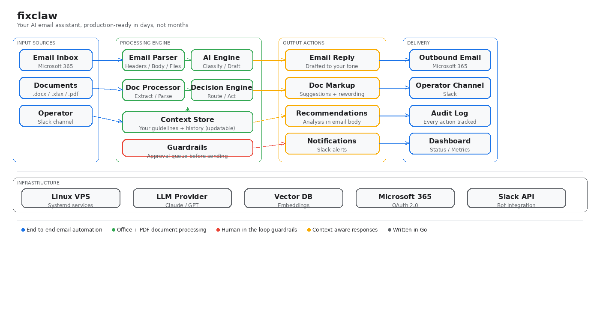

# FixClaw

**AI automation for business operations — with governance built in.**

```yaml
# config.yaml — this is all you write
pipelines:
  - name: email-digest
    schedule: 30m
    steps:
      - name: fetch-unread
        type: deterministic          # plain code: fetch, filter, route
        action: email_unread
      - name: summarize
        type: ai                     # LLM call: budget-checked, schema-validated
        skill: email-digest
      - name: approve
        type: approval               # human reviews before anything goes out
      - name: report
        type: deterministic
        action: notify
```

```
Inbox (200 emails) → FixClaw pipeline → AI summary → Slack approval → you approve → sent
                                  ↑                         ↑
                           budget-checked            nothing leaves
                           schema-validated          without sign-off
```

**Deterministic first. AI is only used for judgment calls — classification, drafting, summarization. Code handles everything else.**

[](https://go.dev)
[](LICENSE)

---

## Quickstart

```bash
git clone https://github.com/renezander030/fixclaw.git && cd fixclaw
cp secrets.yaml.example secrets.yaml   # add your Slack + API keys
go build -o fixclaw . && ./fixclaw
```

Define your pipelines in `config.yaml`, your prompts in `skills/`, and FixClaw handles the rest.

## Why FixClaw

Operations teams use AI assistants for personal productivity. But when AI output touches customers, contracts, or compliance, you need more than a chatbot.

| | **Claude Dispatch** | **OpenClaw** | **FixClaw** |
|---|---|---|---|
| **Purpose** | Personal productivity | Personal AI agent | Business operations |
| **Governance** | Anthropic-managed | None | You own it: YAML pipelines, token budgets, audit trail |
| **Human-in-the-loop** | Pause on destructive actions | Optional | Every outbound action requires operator approval |
| **Token budgets** | None (subscription) | None | Per-step, per-pipeline, per-day limits |
| **Prompt injection defense** | Platform-level | None | Input sanitization + output schema validation |
| **Data residency** | Anthropic cloud | Self-hosted | Self-hosted. Your data stays on your infrastructure |
| **Configuration** | Natural language | Natural language | YAML. Deterministic, version-controlled, auditable |

## Governance and Compliance

Every pipeline run produces a verifiable audit trail:

- **Token budgets** -- per-step, per-pipeline, and per-day limits. Exceeding any budget halts the pipeline immediately. No silent overruns.
- **Human-in-the-loop** -- approval steps present AI output to the operator via Slack/Telegram with approve/edit/reject controls. Nothing leaves the system without explicit sign-off.
- **Input sanitization** -- operator input is scanned for prompt injection patterns, stripped of role markers and formatting that could break prompt boundaries. Rejected inputs are logged silently (no information leakage to attacker).
- **Output validation** -- AI output is validated against the skill's JSON schema. Type checks, range enforcement, required fields. Invalid output is rejected.
- **Rate limiting** -- per-user, per-minute limits on operator interactions prevent abuse.
- **Channel security** -- allowed user lists, input length limits, and markdown stripping are enforced at startup. The engine refuses to start without security configuration.

## How It Works

FixClaw runs pipelines. Each pipeline is a sequence of typed steps:

| Step type | What it does |
|---|---|
| `deterministic` | Plain code: fetch emails, filter, route, notify |
| `ai` | LLM inference with a skill template, budget-checked |
| `approval` | Human-in-the-loop: operator reviews before proceeding |

## Architecture



## Configuration

### config.yaml

Defines LLM providers, models, token budgets, and pipelines.

```yaml
provider:
  type: openrouter
  api_key_env: OPENROUTER_API_KEY
  base_url: https://openrouter.ai/api/v1

models:
  haiku:
    model: anthropic/claude-haiku-4-5
    max_tokens: 1024
  gpt-4o-mini:
    model: openai/gpt-4o-mini
    max_tokens: 1024

budgets:
  per_step_tokens: 2048
  per_pipeline_tokens: 10000
  per_day_tokens: 100000
```

### secrets.yaml

Private values that stay out of version control. Copy `secrets.yaml.example` to get started.

### Skills

YAML prompt templates in `skills/`. Each skill defines the system prompt, input variables, and optional output schema for validation.

```yaml
# skills/classify-job.yaml
name: classify-job
system: |
  You are a job classifier. Given a job posting, determine if it matches
  the freelancer's profile. Return a JSON object with:
  - match: boolean
  - reason: string (one sentence)
  - score: number (0-100)
input_vars:
  - posting
  - profile
output_schema:
  type: object
  required: [match, reason, score]
```

## Project Structure

```
fixclaw/
  main.go          # Engine: pipeline runner, operator bot, scheduler, guardrails
  gmail.go         # Gmail / Microsoft 365 integration (OAuth 2.0, read + send with HITL approval)
  config.yaml      # Pipelines, models, budgets, timeouts
  secrets.yaml     # Private config (operator IDs) -- gitignored
  skills/          # Prompt templates with schema validation
```

## Contributing

Contributions welcome. Check the [issues](https://github.com/renezander030/fixclaw/issues) for `good first issue` labels — they're scoped to be completable without understanding the full codebase.

## Built by

[Rene Zander](https://dev.to/reneza) — I build AI automation systems for operations teams. If you need something like FixClaw customized for your business, [book a call](https://cal.eu/reneza).

## License

MIT. See [LICENSE](LICENSE).
