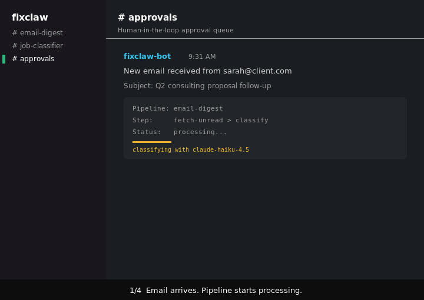

# FixClaw

AI communication management for service businesses -- with governance built in.

FixClaw is a pipeline engine written in Go that puts AI to work on real communication workflows (email triage, CRM lead follow-ups, opportunity recovery) while enforcing token budgets, audit trails, input sanitization, and human-in-the-loop approval on every outbound action.

**AI never executes. Deterministic code does.**



## Quickstart

```bash
git clone https://github.com/renezander030/fixclaw.git && cd fixclaw
cp secrets.yaml.example secrets.yaml   # add your Slack + API keys
go build -o fixclaw . && ./fixclaw
```

Define your pipelines in `config.yaml`, your prompts in `skills/`, and FixClaw handles the rest.

## Why FixClaw

Service businesses run on communication -- emails, CRM follow-ups, lead qualification. AI can handle the volume, but when AI output touches real customers, you need guardrails.

## Integrations

| Platform | What FixClaw does |
|---|---|
| **Gmail / Microsoft 365** | Email triage, AI-drafted replies, digest summaries |
| **GoHighLevel** | Lead triage, stale opportunity recovery, conversation follow-ups |
| **Slack / Telegram** | Operator approval channel (human-in-the-loop) |

More connectors can be added by implementing a single Go file. Each integration follows the same pattern: fetch data, classify with AI, draft a response, get human approval before sending.

| | **Claude Dispatch** | **OpenClaw** | **FixClaw** |
|---|---|---|---|
| **Purpose** | Personal productivity | Personal AI agent | Business operations |
| **Governance** | Anthropic-managed | None | You own it: YAML pipelines, token budgets, audit trail |
| **Human-in-the-loop** | Pause on destructive actions | Optional | Every outbound action requires operator approval |
| **Token budgets** | None (subscription) | None | Per-step, per-pipeline, per-day limits |
| **Prompt injection defense** | Platform-level | None | Input sanitization + output schema validation |
| **Data residency** | Anthropic cloud | Self-hosted | Self-hosted. Your data stays on your infrastructure |
| **Configuration** | Natural language | Natural language | YAML. Deterministic, version-controlled, auditable |

## Governance and Compliance

Every pipeline run produces a verifiable audit trail:

- **Token budgets** -- per-step, per-pipeline, and per-day limits. Exceeding any budget halts the pipeline immediately. No silent overruns.
- **Human-in-the-loop** -- approval steps present AI output to the operator via Slack/Telegram with approve/edit/reject controls. Nothing leaves the system without explicit sign-off.
- **Input sanitization** -- operator input is scanned for prompt injection patterns, stripped of role markers and formatting that could break prompt boundaries. Rejected inputs are logged silently (no information leakage to attacker).
- **Output validation** -- AI output is validated against the skill's JSON schema. Type checks, range enforcement, required fields. Invalid output is rejected.
- **Rate limiting** -- per-user, per-minute limits on operator interactions prevent abuse.
- **Channel security** -- allowed user lists, input length limits, and markdown stripping are enforced at startup. The engine refuses to start without security configuration.

## How It Works

FixClaw runs pipelines. Each pipeline is a sequence of typed steps:

| Step type | What it does |
|---|---|
| `deterministic` | Plain code: fetch emails, filter, route, notify |
| `ai` | LLM inference with a skill template, budget-checked |
| `approval` | Human-in-the-loop: operator reviews before proceeding |

Example pipelines:

```yaml
pipelines:
  # Email digest -- summarize unread emails every 30 minutes
  - name: email-digest
    schedule: 30m
    steps:
      - name: fetch-unread
        type: deterministic
        action: gmail_unread

      - name: summarize
        type: ai
        skill: email-digest

      - name: report
        type: deterministic
        action: notify

  # Lead triage -- classify new CRM contacts hourly
  - name: lead-triage
    schedule: 1h
    steps:
      - name: fetch-contacts
        type: deterministic
        action: ghl_new_contacts

      - name: classify
        type: ai
        skill: triage-lead

      - name: review
        type: approval
        mode: hitl
        channel: telegram

  # Opportunity recovery -- re-engage stale deals daily
  - name: opportunity-recovery
    schedule: 24h
    steps:
      - name: fetch-stale
        type: deterministic
        action: ghl_stale_opportunities
        vars:
          pipeline_id: your-pipeline-id

      - name: draft-followup
        type: ai
        skill: draft-ghl-followup

      - name: approve-send
        type: approval
        mode: hitl
        channel: telegram
```

## Architecture


## Configuration

### config.yaml

Defines LLM providers, models, token budgets, and pipelines.

```yaml
provider:
  type: openrouter
  api_key_env: OPENROUTER_API_KEY
  base_url: https://openrouter.ai/api/v1

models:
  haiku:
    model: anthropic/claude-haiku-4-5
    max_tokens: 1024
  gpt-4o-mini:
    model: openai/gpt-4o-mini
    max_tokens: 1024

budgets:
  per_step_tokens: 2048
  per_pipeline_tokens: 10000
  per_day_tokens: 100000
```

### secrets.yaml

Private values that stay out of version control. Copy `secrets.yaml.example` to get started.

### Skills

YAML prompt templates in `skills/`. Each skill defines the system prompt, input variables, and optional output schema for validation.

```yaml
# skills/classify-job.yaml
name: classify-job
system: |
  You are a job classifier. Given a job posting, determine if it matches
  the freelancer's profile. Return a JSON object with:
  - match: boolean
  - reason: string (one sentence)
  - score: number (0-100)
input_vars:
  - posting
  - profile
output_schema:
  type: object
  required: [match, reason, score]
```

## Project Structure

```
fixclaw/
  main.go          # Engine: pipeline runner, operator bot, scheduler, guardrails
  gmail.go         # Gmail / Microsoft 365 integration (OAuth 2.0, read + send)
  gohighlevel.go   # GoHighLevel CRM integration (contacts, opportunities, conversations)
  config.yaml      # Pipelines, models, budgets, timeouts
  secrets.yaml     # Private config (operator IDs) -- gitignored
  skills/          # Prompt templates with schema validation
    email-digest.yaml
    classify-job.yaml
    draft-followup.yaml
    triage-lead.yaml
    draft-ghl-followup.yaml
```

## License

MIT. See [LICENSE](LICENSE).
