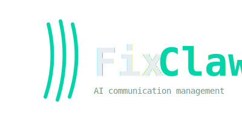

<p align="center">
  
</p>

<h1 align="center">Draftyard</h1>
<p align="center">Governed AI pipelines for service businesses — written in Go.</p>

<p align="center">
  <a href="https://github.com/renezander030/draftyard/stargazers"></a>
  <a href="https://github.com/renezander030/draftyard/blob/master/LICENSE"></a>
  
  
  
</p>

Draftyard runs YAML-defined pipelines that triage email, qualify leads, draft replies, and extract data from PDFs. Every outbound action passes through an operator approval gate; every LLM call is budget-checked; every fetched item is deduped against a SQLite state store. Single Go binary.

**AI suggests. Deterministic code decides. The operator signs off.**

## Why Draftyard vs the alternatives

|                              | **Draftyard**                                    | **n8n**                                    | **LangChain agents**                |
| ---------------------------- | ---------------------------------------------- | ------------------------------------------ | ----------------------------------- |
| **Built for**                | AI-augmented business ops with governance      | General workflow automation                | Open-ended agent loops              |
| **AI execution model**       | Deterministic boundary; AI cannot fire actions | Bolt-on LLM nodes inside visual workflows  | Agent decides next action freely    |
| **Human-in-the-loop**        | Required on every outbound step                | Optional manual nodes                      | Optional; not the default           |
| **Token budgets**            | Per-step / pipeline / day, enforced            | None                                       | None                                |
| **Prompt-injection defense** | Input sanitization + output schema validation  | None                                       | None                                |
| **State & dedup**            | SQLite-backed; items processed at most once    | DB-backed                                  | In-memory                           |
| **Config format**            | YAML (code-reviewable, gitable)                | Visual editor + JSON export                | Python code                         |
| **Runtime**                  | Single Go binary                               | Node.js + Postgres                         | Python + dependency tree            |
| **Approval channels**        | Telegram, Slack (WIP)                          | Webhook / email                            | None built-in                       |

**Versus n8n**, Draftyard treats AI as the gated minority, not the default. n8n is a powerful no-code workflow tool with AI nodes bolted on; Draftyard is a code-first engine where every AI suggestion must pass schema validation and operator approval before it touches a customer. If you want drag-drop integrations across 400+ services, use n8n. If you want deterministic governance on a focused set of business ops, use Draftyard.

**Versus LangChain agents**, Draftyard refuses to let the LLM choose the next action. There is no agent loop — pipelines are fixed sequences of `deterministic` / `ai` / `approval` steps defined in YAML. The LLM produces structured output; the engine validates it against a schema; the operator approves it. LangChain is for research and open-ended exploration. Draftyard is for production systems where a wrong LLM choice means a real customer gets emailed.

## Why this exists

Service businesses run on volume communication — replying to leads, qualifying inbound, chasing stale deals, parsing invoices. AI handles the volume easily but is wrong often enough that you can't let it touch a customer without a human in the path. Draftyard is the smallest engine that makes that pattern routine: deterministic Go code does the fetching, routing, and dedup; AI does the drafting and classification under a token budget; an operator approves on Telegram or Slack before anything goes out. One business per instance, self-hosted, auditable.


## Quickstart

```bash
git clone https://github.com/renezander030/draftyard.git && cd draftyard
cp secrets.yaml.example secrets.yaml   # operator IDs + API keys
go build -o draftyard . && ./draftyard
```

Define pipelines in `config.yaml`, prompts in `skills/`. The engine opens a SQLite state store at `./state.db` on first boot.

## How it works

Each pipeline is a sequence of typed steps:

| Step type        | What it does                                                          |
| ---------------- | --------------------------------------------------------------------- |
| `deterministic`  | Plain Go — fetch emails, parse PDFs, dedup, route, notify             |
| `ai`             | LLM inference with a skill template, budget-checked, schema-validated |
| `approval`       | Operator reviews via Telegram / Slack: approve / edit / reject        |

```yaml
pipelines:
  - name: invoice-due-diligence
    schedule: 1h
    steps:
      - name: parse-pdf
        type: deterministic
        action: pdf_extract
        vars: {path: /inbox/invoice.pdf}

      - name: extract-line-items
        type: ai
        skill: extract-line-items

      - name: verify-citations
        type: deterministic
        action: pdf_verify_cite
        vars: {fail_on_unresolved: "true"}

      - name: operator-review
        type: approval
        mode: hitl
        channel: telegram
```

## Built-in actions

| Action                       | What it does                                                              |
| ---------------------------- | ------------------------------------------------------------------------- |
| `gmail_unread`               | Fetch unread Gmail messages (deduped per pipeline)                        |
| `ghl_new_contacts`           | Fetch recent GoHighLevel contacts (deduped)                               |
| `ghl_stale_opportunities`    | Fetch stalled GHL opportunities (requires `vars.pipeline_id`)             |
| `ghl_unread_conversations`   | Fetch unread GHL conversations (deduped by `id + last_message_date`)      |
| `pdf_extract`                | Parse a PDF into text + per-fragment bounding boxes (pure-Go)             |
| `pdf_verify_cite`            | Resolve `<cite>` tags in AI output against the parsed PDF                 |
| `notify`                     | Send AI output to the operator channel                                    |
| `voice_calls_completed`      | Harvest completed voice calls from the writeback layer (requires `-tags voice`) |
| `voice_handoffs_pending`     | Harvest unresolved handoff requests (requires `-tags voice`)              |
| `voice_learnings_new`        | Harvest agent-flagged Learning-Items for the 7-step review (requires `-tags voice`) |

Add a new action by appending a `case` to the deterministic switch in `main.go` and registering its name in `validate.go`. See `gohighlevel.go` for the connector pattern.

### Voice (EU residency, build tag `voice`)

Optional plugin that turns draftyard into the **EU-resident governance and writeback layer** for a self-hosted voice-AI stack (Dograh as the reference orchestrator). The plugin adds an HTTP receiver for 5 session lifecycle webhooks plus a pre-call context lookup endpoint, persists everything to the same SQLite state DB, and exposes 3 harvest actions that feed completed calls / handoffs / Learning-Items into normal draftyard pipelines (approval gate, schema validation, budget caps, audit log).

```sh
go build -tags voice -o draftyard
```

The lean binary is unchanged when the tag is off. See [`docs/voice.md`](docs/voice.md) for the wiring guide and [`fixtures/voice-dach-screener/pipeline.yaml`](fixtures/voice-dach-screener/pipeline.yaml) for a runnable example pipeline.

## State & idempotency

Draftyard persists cross-run state to SQLite at the path set in `config.yaml`:

```yaml
state:
  path: ./state.db   # default if omitted
```

- **Dedup.** Fetched item IDs (Gmail message IDs, GHL contact IDs, etc.) are recorded in `seen_items`. Subsequent runs skip already-processed items. Dedup is per `(pipeline, scope)` — the same item can be processed by two pipelines without interference.
- **Run history.** Every pipeline run records `pipeline / started_at / ended_at / status / error_text` to `pipeline_runs`.
- **Crash safety.** WAL mode + `synchronous=NORMAL` for durable writes without per-write fsync.

Items are marked seen at fetch time — once fetched, they won't be re-processed even if a downstream step fails. Replay manually via the `/run <pipeline>` operator command.

## Governance

- **Token budgets** — per-step / per-pipeline / per-day caps. Exceeding any budget halts the pipeline immediately.
- **Human-in-the-loop** — every outbound action requires explicit operator approval.
- **Input sanitization** — operator input is scrubbed for prompt-injection patterns before reaching the LLM.
- **Output validation** — AI output is validated against the skill's JSON schema. Invalid output is rejected.
- **Rate limiting** — per-user, per-minute limits on operator interactions.
- **Channel security** — allowed-user lists and input-length limits enforced at startup. Engine refuses to start without them.

## Configuration

```yaml
provider:
  type: openrouter
  api_key_env: OPENROUTER_API_KEY

models:
  haiku:       {model: anthropic/claude-haiku-4-5, max_tokens: 1024}
  gpt-4o-mini: {model: openai/gpt-4o-mini,         max_tokens: 1024}

budgets:
  per_step_tokens:     2048
  per_pipeline_tokens: 10000
  per_day_tokens:      100000

state:
  path: ./state.db
```

Skills are YAML prompt templates in `skills/`:

```yaml
# skills/classify-job.yaml
name: classify-job
system: |
  You are a job classifier. Given a job posting, return a JSON object with
  match (boolean), reason (one sentence), and score (0-100).
input_vars: [posting, profile]
output_schema:
  type: object
  required: [match, reason, score]
```

## Commands

```bash
draftyard                       # run the engine
draftyard validate [--strict]   # lint config + skills
draftyard test <pipeline>       # dry-run against fixtures/<pipeline>/
```

`draftyard test` walks the pipeline using JSON fixtures — never touches real APIs. AI steps return fixture text; approval steps auto-approve. See `fixtures/README.md`.

## Development

Pre-commit hooks (lefthook) run `gofmt`, `go vet`, `go build`, and `go test -short` in parallel on every staged Go file. Pre-push runs `draftyard validate --strict`.

```bash
make check       # fmt-check + vet + test-fast + build
make test-fast   # short test pass
```


## Patterns explained

The deterministic-boundary architecture is documented in the **Production AI Automation Notes** gist series. Each entry maps to specific draftyard code:

- [#1 Agent Approval Gates](https://gist.github.com/renezander030/9069db775e494ffd2cdd5a09adf83add) — proposed actions, schema validation, audit log
- [#2 Token Budgets](https://gist.github.com/renezander030/a7d99ad94b97f7943a9a04016d62faaa) — per-step, per-pipeline, per-day enforcement (`BudgetTracker` in `main.go`)
- [#5 SQLite Dedup + Crash Safety](https://gist.github.com/renezander030/8a23e32cde0c882a5aa069c4bfdf697f) — WAL mode, `seen_items`, run audit (`state.go`)
- [#6 Prompt-Injection Defense](https://gist.github.com/renezander030/213ffdf1ab1bdb169881927bc7080270) — input sanitization + output schema validation (`ChannelSecurity` + `skills/*.yaml`)
- [#7 PDF Cite Verification](https://gist.github.com/renezander030/7780cbc0b3ad4e802e8fba8bfc1c3a66) — auditable LLM extraction with per-fragment bounding boxes (`pdf.go`)

## Related projects

- [capcut-cli](https://github.com/renezander030/capcut-cli) — CLI to edit CapCut and JianYing video drafts. Same design DNA: single binary, no API needed, structured JSON boundary between agent and tool.

## Status

**v0.1** — early access. Single-business, single-operator deployments. Public APIs may change between minor versions until v1.0.

Roadmap signals: webhook triggers, generic HTTP actions, per-step retry & circuit breaker, Slack approval channel, structured JSON logging + Prometheus metrics, Google Sheets connector.

## Star History

[](https://star-history.com/#renezander030/draftyard&Date)

## License

MIT. See [LICENSE](LICENSE).
